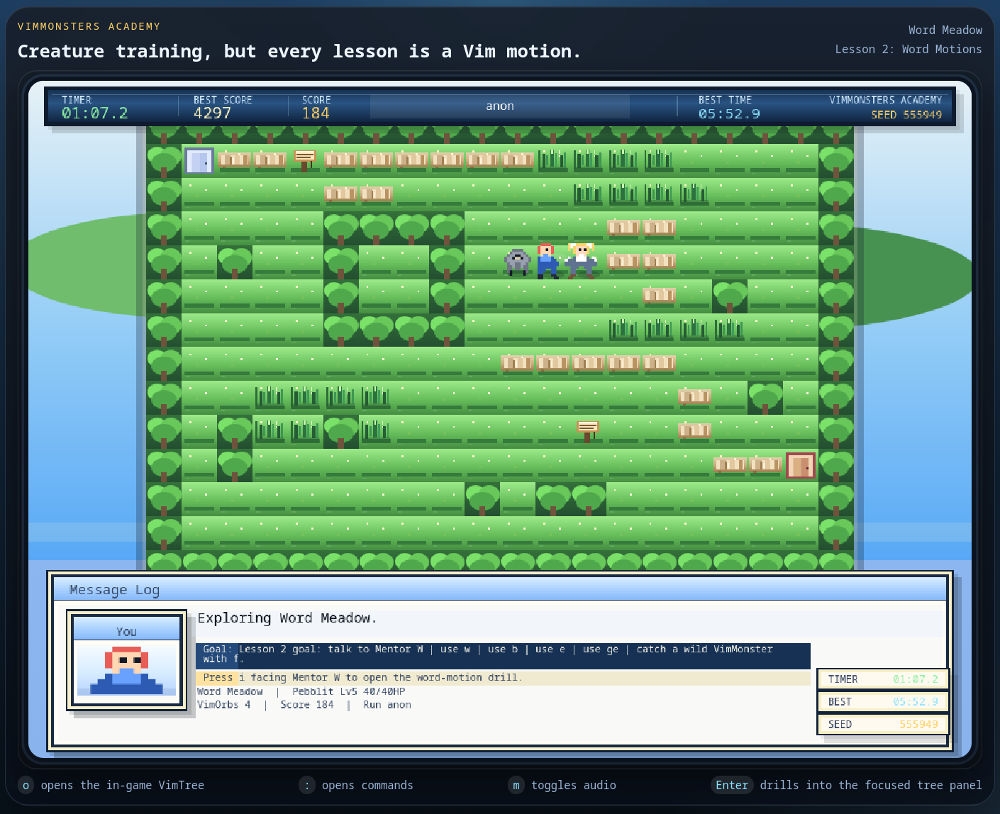
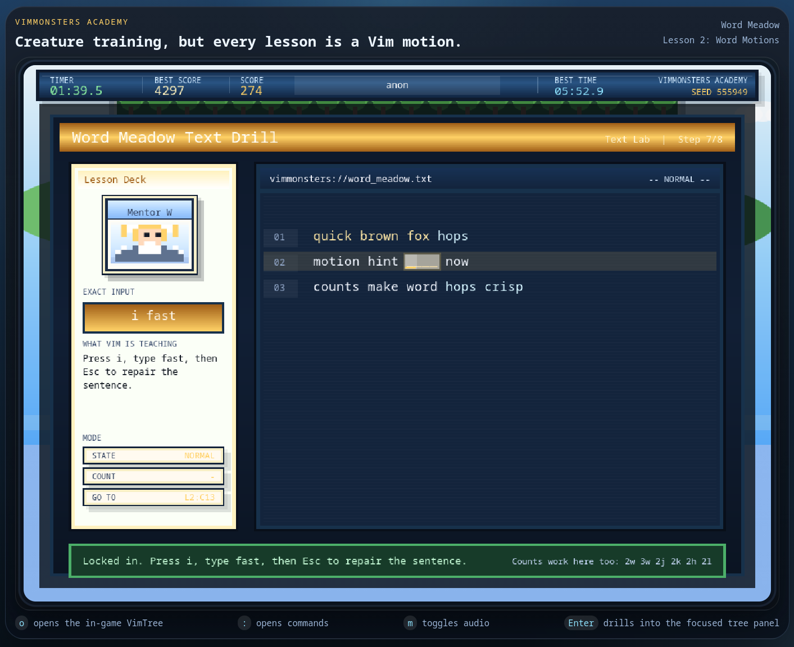
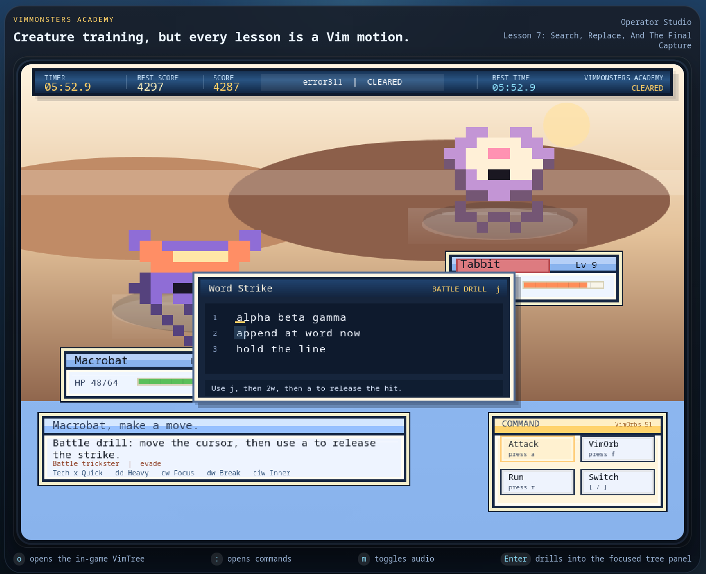

# VimMonsters Academy

VimMonsters Academy is a browser game that teaches Vim motions through a retro creature-catching RPG. It is also structured as a learning codebase: people should be able to read it, fork it, mod it, and extend it without first untangling one giant file.

The project is released under the MIT License in [LICENSE](LICENSE).

VimMonsters Academy is an independent learning project and is not affiliated with or endorsed by Vim.

## Preview

Overworld and progression screenshot:



Drill system screenshot:



Battle and mini-drill screenshot:



## Goals

- Teach Vim motions through play, drills, and battle interactions
- Stay readable enough to use as a programming learning project
- Be easy to fork for new lessons, new creatures, new art, and new maps

## Requirements

- Node.js 22 or newer
- npm
- Docker, if you want to run the container build

The repo includes [.nvmrc](.nvmrc) and the GitHub Actions workflows use Node 22.

## Run Locally

```bash
cd vimmonsters-academy
npm install
npm run serve
```

Then open `http://localhost:8002`.

If `8002` is busy:

```bash
PORT=8004 npm run serve
```

Leaderboard data is written to `leaderboard.json` in the project root unless you override it:

```bash
LEADERBOARD_PATH=./data/leaderboard.json npm run serve
```

If you want the public competition API to persist its used-run state too:

```bash
LEADERBOARD_PATH=./data/leaderboard.json \
COMPETITION_STATE_PATH=./data/competition-state.json \
npm run serve
```

## Run With Docker

Build the image:

```bash
cd vimmonsters-academy
docker build -t vimmonsters-academy .
```

Run it:

```bash
docker run --rm -p 8002:8002 -v "$(pwd)/data:/data" vimmonsters-academy
```

Then open `http://localhost:8002`.

Notes:

- leaderboard data is written to `/data/leaderboard.json` inside the container
- the bind mount keeps leaderboard data between container runs
- if you do not care about persistence, you can drop the `-v "$(pwd)/data:/data"` mount
- if `8002` is busy on your machine, change the published port: `docker run --rm -p 8004:8002 -v "$(pwd)/data:/data" vimmonsters-academy`

For public hosting, pass a real competition secret and persist both JSON files:

```bash
docker run --rm \
  -p 8002:8002 \
  -e COMPETITIVE_SECRET="replace-this-with-a-long-random-secret" \
  -e LEADERBOARD_PATH=/data/leaderboard.json \
  -e COMPETITION_STATE_PATH=/data/competition-state.json \
  -v "$(pwd)/data:/data" \
  vimmonsters-academy
```

## Public Hosting

The server is now safer for public hosting than the old trust-the-browser flow:

- the browser can no longer overwrite the full leaderboard
- runs are append-only submissions, not arbitrary leaderboard writes
- each run starts with a server-issued signed run ticket
- submissions are rate-limited and body-size limited
- the server only serves public game files, not repo internals like `package.json`, `server.js`, or dotfiles
- static responses ship with stricter security headers

Recommended environment variables for public hosting:

- `COMPETITIVE_SECRET`: required in practice; use a long random secret
- `LEADERBOARD_PATH`: persistent JSON file for leaderboard entries
- `COMPETITION_STATE_PATH`: persistent JSON file for used run tickets
- `HOST`: bind host, defaults to `0.0.0.0`
- `PORT`: listen port, defaults to `8002`
- `MIN_RUN_MS`, `MAX_RUN_MS`, `MAX_SCORE`, `MAX_SCORE_PER_SECOND`: optional competition guardrails

Start from [.env.example](.env.example) when setting up a real hosted instance.

Important limitation:

This is still a client-side game. The public leaderboard flow is much safer now, but it is not fully cheat-proof against a determined attacker who modifies the browser client. To get truly strong anti-cheat, you would need server-authoritative gameplay or a server-side replay verifier with a much richer proof-of-play model.

## Development Workflow

```bash
cd vimmonsters-academy
npm install
npm run build:assets
npm run serve
```

Use this when you are editing game logic, content, sprites, or UI. Re-run `npm run build:assets` after changing sprite frame data or palette-driven art in [src/content.js](src/content.js).

## Checks

```bash
cd vimmonsters-academy
npm install
npm run build:assets
npm run build:readme-media
npm run lint
npm run check
npm run smoke
```

Use [TESTING.md](TESTING.md) for the manual runtime checklist after gameplay, UI, or refactor changes.

## Lesson Flow

1. Home Row House: learn `h` `j` `k` `l`, then choose a starter VimMonster
2. Word Meadow: learn `w`, `b`, `e`, and `ge`, then catch your first wild VimMonster
3. Line Ridge: learn `0`, `$`, `^`, `x`, and party switching with `[` `]`
4. Count Grove: learn count prefixes like `3w` and `2j`, plus `dd` and `cw`
5. Finder Fen: learn `f`, `t`, `F`, `T`, and repeat-find with `;` and `,`
6. Operator Studio: learn `dw` and `ciw`
7. Macro Tower: learn `gg`, `G`, `/`, and `:replace`, then beat or catch the final boss

## Main Controls

- `h` `j` `k` `l`: move
- `i`: inspect or talk to what is in front of you
- `o`: toggle the in-game VimTree
- `Enter`: focus the selected VimTree section
- `w` `b`: move one tile forward or backward once unlocked
- `e` `ge`: word-end motions in drills
- `f` `t` `F` `T`: character find motions in drills and battle mini-drills
- `;` `,`: repeat the last find forward or in reverse
- `1-9` + motion: counted motions like `3w` or `2j`
- `0` `$` `^`: line motions once unlocked
- `gg` `G`: file motions once unlocked
- `[` `]`: cycle the active VimMonster once unlocked
- `.`: repeat the last learned motion once unlocked
- `R`: rename the current run
- `m`: mute or unmute music and sound
- `:`: command mode for `:help`, `:party`, `:map`, `:lesson`, `:name`, `:q`, `:w`, `:load`, `:heal`

## Battle Controls

- `a`: attack
- `x`: Quick Jab after the ridge lesson
- `dd`: Heavy Slam after the grove lesson
- `cw`: Focus Ball, which powers the next VimOrb after the grove lesson
- `dw`: Break Word after the studio lesson
- `ciw`: Inner Word after the studio lesson
- `f`: throw a VimOrb
- `r`: run
- `[` `]`: switch to a different party member

## Project Structure

- [src/content.js](src/content.js): editable game content and modding surface
- [src/game.js](src/game.js): main orchestration and system wiring
- [src/state.js](src/state.js): run setup, state helpers, map randomization, and monster creation
- [src/drills.js](src/drills.js): lesson drill definitions and drill hydration
- [src/drill-runtime.js](src/drill-runtime.js): drill cursor, prompt, and insert-mode state machine
- [src/battle.js](src/battle.js): encounters, battles, catches, and party switching flow
- [src/battle-challenges.js](src/battle-challenges.js): authored battle mini-drill templates
- [src/input.js](src/input.js): command mode, rename mode, VimTree navigation, and key normalization
- [src/overworld.js](src/overworld.js): overworld movement, gate transitions, and NPC/sign interactions
- [src/progression.js](src/progression.js): lesson completion, objective text, gate text, and control unlock rules
- [src/render.js](src/render.js): reusable canvas primitives and text helpers
- [src/bitmap-assets.js](src/bitmap-assets.js): bitmap asset loader and sprite-sheet metadata
- [src/persistence.js](src/persistence.js): leaderboard, save payload, and storage helpers
- [src/scenes.js](src/scenes.js): scene composition and shared HUD layout
- [src/scene-tree.js](src/scene-tree.js): VimTree overlay renderer
- [src/scene-drill.js](src/scene-drill.js): lesson deck and drill editor overlay renderer
- [src/scene-battle.js](src/scene-battle.js): battle scene, command window, and battle mini-drill overlay rendering
- [server.js](server.js): static file server plus persistent leaderboard API
- [scripts/build-bitmaps.mjs](scripts/build-bitmaps.mjs): rasterizes trainer, creature, and UI PNGs
- [scripts/build-readme-media.mjs](scripts/build-readme-media.mjs): optional helper for regenerating README preview media in `docs/media`
- [scripts/runtime-smoke.mjs](scripts/runtime-smoke.mjs): automated runtime smoke for the client-side game logic
- [scripts/api-smoke.mjs](scripts/api-smoke.mjs): API smoke for the public competition server flow
- [TESTING.md](TESTING.md): manual runtime checklist
- [ARCHITECTURE.md](ARCHITECTURE.md): module ownership and common change paths
- [CONTENT_GUIDE.md](CONTENT_GUIDE.md): shortest path for adding lessons, creatures, trainers, and maps
- [MODDING.md](MODDING.md): more detailed modding/customization guide
- [CONTRIBUTING.md](CONTRIBUTING.md): contribution workflow and expectations
- [SECURITY.md](SECURITY.md): how to report vulnerabilities or hosting abuse issues
- [.github/PULL_REQUEST_TEMPLATE.md](.github/PULL_REQUEST_TEMPLATE.md): PR checklist and reviewer context

## Modding Quick Start

Start here if you want to change content without rewriting engine code:

- edit `PLAYER_STYLE`, `NPC_STYLES`, `CREATURES`, `LESSONS`, `MAPS`, `RANDOMIZATION_RULES`, or `CONTROL_INFO` in [src/content.js](src/content.js)
- add or update drills in [src/drills.js](src/drills.js)
- read [CONTENT_GUIDE.md](CONTENT_GUIDE.md) for the shortest path
- read [MODDING.md](MODDING.md) for more detailed examples

If you change sprite frame data or palettes:

```bash
npm run build:assets
```

## Contributing

Use [CONTRIBUTING.md](CONTRIBUTING.md).

The short version:

- keep the code readable for learners
- keep the game friendly for new Vim users
- run `npm run build:assets`, `npm run build:readme-media`, `npm run lint`, `npm run check`, and `npm run smoke`
- use [TESTING.md](TESTING.md) after gameplay or UI changes

## GitHub Automation

The repo now includes:

- issue templates in [.github/ISSUE_TEMPLATE](.github/ISSUE_TEMPLATE)
- CI in [.github/workflows/ci.yml](.github/workflows/ci.yml) for asset build, lint, syntax check, and runtime smoke
- Docker build verification in [.github/workflows/docker.yml](.github/workflows/docker.yml)

## Repo Readiness

For a clean public repo, make sure each change set does these before merge:

- update docs if controls, lessons, or run steps changed
- rebuild generated art if sprite definitions changed
- run `npm run lint`, `npm run check`, and `npm run smoke`
- use [TESTING.md](TESTING.md) for gameplay or UI changes
- include screenshots or GIFs in the PR if the visible UI changed

## Notes

- the leaderboard is JSON-backed through [server.js](server.js)
- public competition runs now use server-issued run tickets plus append-only leaderboard submission
- the game uses browser ES modules and a shared runtime `app` object in [src/game.js](src/game.js)
- the runtime is split so learners can study one system at a time instead of reading a single giant file first
- `docs/media` now contains the repository screenshots used in the README preview section
